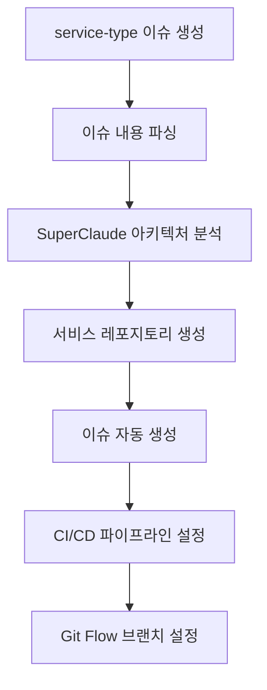
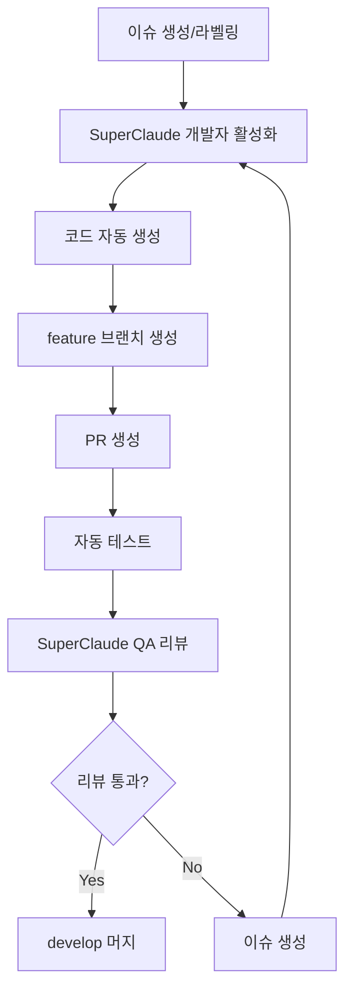
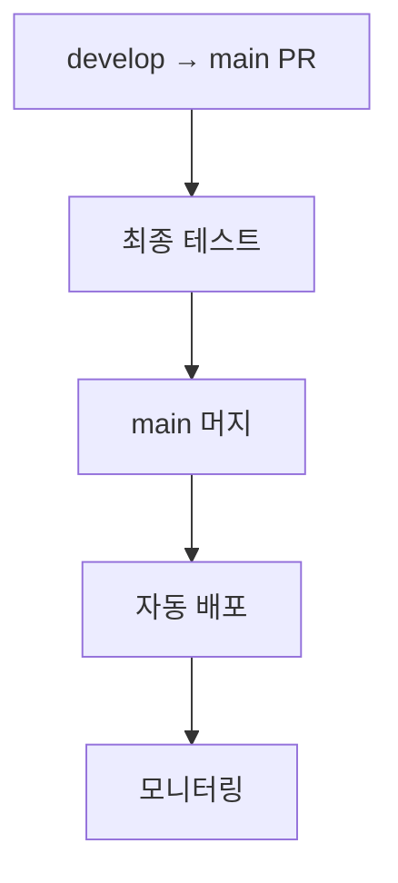

# SuperClaude 자동화 파이프라인 설정 가이드

## 필수 환경 변수 설정

### 1. GitHub 조직 시크릿 설정

조직 레벨에서 다음 시크릿을 설정해야 합니다:

```bash
# GitHub 조직 설정 페이지에서 설정
# https://github.com/organizations/code-orchestration/settings/secrets/actions

ANTHROPIC_API_KEY=sk-ant-api03-xxxxx  # Claude API 키
GH_ORG_TOKEN=ghp_xxxxx                 # GitHub 조직 관리 토큰 (repo, workflow, admin:org 권한 필요)
```

### 2. 로컬 환경 설정 (테스트용)

```bash
export ANTHROPIC_API_KEY="your-api-key"
export GH_ORG_TOKEN="your-github-token"
```

## 시스템 아키텍처

```
code-orchestration/
├── command-center/                 # 메인 오케스트레이터
│   ├── .github/
│   │   ├── workflows/
│   │   │   └── service-orchestrator.yml
│   │   └── ISSUE_TEMPLATE/
│   │       └── service-request.yml
│   ├── scripts/
│   │   ├── create-service.js      # 서비스 생성 스크립트
│   │   └── setup-gitflow.js       # Git Flow 설정
│   └── templates/                  # 서비스 템플릿
│       ├── service-template/
│       └── deployment/
│
└── [생성된 서비스들]/              # 자동 생성되는 서비스 레포지토리
    ├── service-1/
    ├── service-2/
    └── ...
```

## 워크플로우

### 1. 서비스 생성 플로우



### 2. 자동 개발 플로우



### 3. 배포 플로우



## 사용 방법

### 1. 새 서비스 생성

1. command-center 레포지토리에서 새 이슈 생성
2. 이슈 템플릿 선택: "서비스 생성 요청"
3. 필요한 정보 입력
4. 이슈 제출

### 2. 서비스 개발 자동화

생성된 서비스 레포지토리에서:

1. 이슈가 자동 생성됨
2. `auto-develop` 라벨을 추가하면 자동 개발 시작
3. PR이 자동 생성되고 리뷰 진행
4. 리뷰 통과 시 자동 머지

### 3. 수동 개입이 필요한 경우

- SuperClaude가 해결하지 못한 이슈는 수동으로 처리
- PR 리뷰에서 문제 발견 시 수동 수정
- 배포 설정 커스터마이징

## SuperClaude 페르소나 활용

### 아키텍처 페르소나
- 서비스 설계 및 구조화
- 기능 명세 작성
- 이슈 분해 및 우선순위 설정

### 개발자 페르소나
- 이슈 기반 코드 자동 생성
- 테스트 코드 작성
- 버그 수정

### QA 페르소나
- PR 코드 리뷰
- 버그 및 개선사항 발견
- 품질 기준 검증

## 트러블슈팅

### API 키 문제
```bash
# 시크릿 확인
gh secret list --org code-orchestration

# 시크릿 설정
gh secret set ANTHROPIC_API_KEY --org code-orchestration
gh secret set GH_ORG_TOKEN --org code-orchestration
```

### 워크플로우 디버깅
```bash
# 워크플로우 실행 확인
gh run list --repo code-orchestration/command-center

# 워크플로우 로그 확인
gh run view [run-id] --log
```

### 수동 서비스 생성
```bash
cd command-center
node scripts/create-service.js
```

## 보안 고려사항

1. **API 키 관리**: 절대 코드에 하드코딩하지 않음
2. **권한 최소화**: 필요한 최소 권한만 부여
3. **브랜치 보호**: main, develop 브랜치 보호 규칙 적용
4. **코드 리뷰**: 자동 생성 코드도 항상 리뷰

## 제한사항

1. **API 사용량**: Claude API 사용량 제한 고려
2. **복잡도**: 매우 복잡한 로직은 수동 개입 필요
3. **테스트**: 자동 생성 테스트의 커버리지 한계
4. **배포**: 프로덕션 배포는 수동 승인 권장

## 개선 사항

향후 구현 예정:
- [ ] 멀티 언어 지원 확대
- [ ] 더 다양한 배포 옵션
- [ ] 성능 모니터링 통합
- [ ] 자동 롤백 기능
- [ ] A/B 테스팅 지원